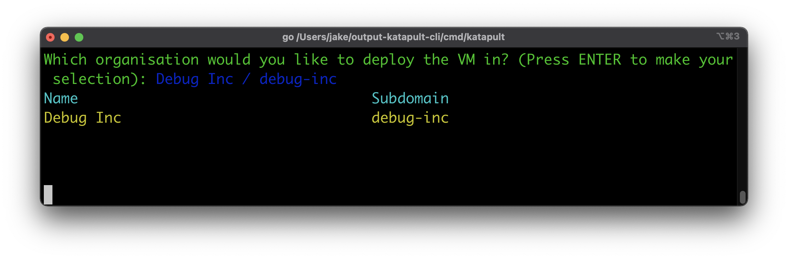
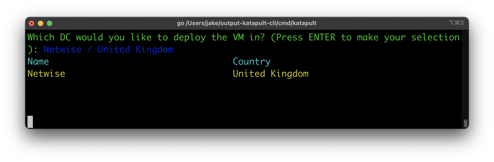
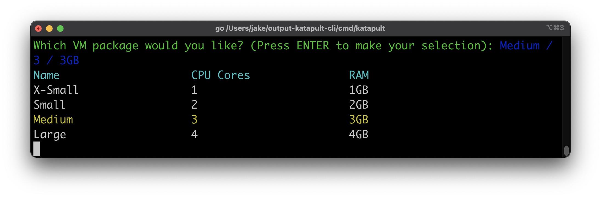
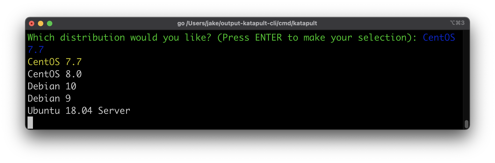
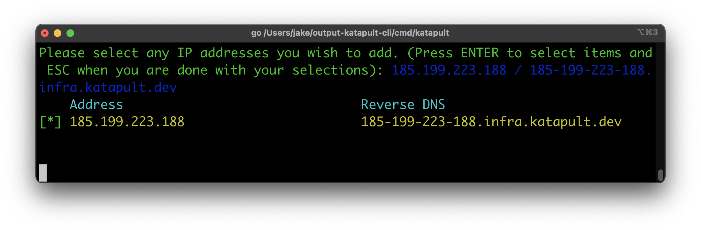
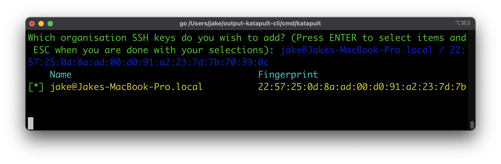
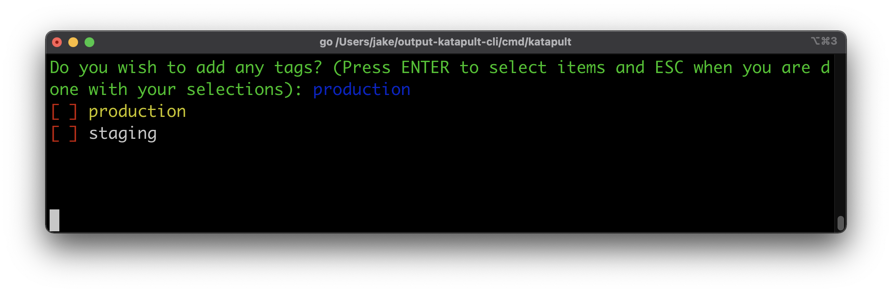
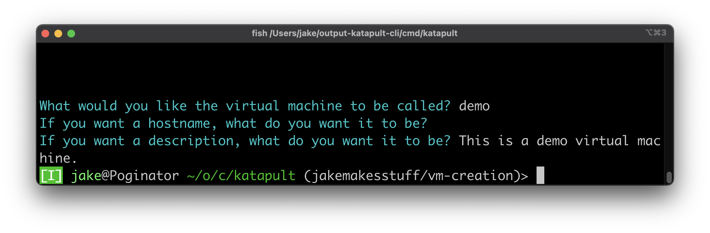

# Virtual Machine Actions

## Listing
Lists all of the current virtual machines. You can do this with `vms list`. Takes either `--id` or a subdomain for the organization:

```
$ katapult vms list debug-inc
+-------+--------------------------------+
| NAME  |              FQDN              |
+-------+--------------------------------+
| demo  | testing.debug-inc.st.kpult.com |
| hello | world.debug-inc.st.kpult.com   |
+-------+--------------------------------+
```

## Power Actions
There are various power actions you can perform with VM's:
- `vms poweroff <--fqdn or --id>`: Powers off a virtual machine.
- `vms start <--fqdn or --id>`: Starts a virtual machine.
- `vms stop <--fqdn or --id>`: Stops a virtual machine.
- `vms reset <--fqdn or --id>`: Reset a virtual machine.

## Creation Wizard
TODO: Params

The virtual machine creation wizard allows you to easily create virtual machines. The idea is that you will rapidly be able to create a VM by following simple instructions. When you run `vms create`, you will be greeted by this screen:



This will allow you to select the organization you want.

It is important to note that for multiple of the input boxes in the CLI, we have pioneered our own fast selection method. When you have a single selection like this, you can type to search for items with a specific term in them. You can then use the arrow keys to select aroudn them.

For input methods later which are multiple selection, since enter is used for the selection of items, escape is used to submit your multiple selection.

You will then be asked the data centre that you wish to deploy the VM in:



Once this is selected, the next steps are to select the package and distribution:




When it comes to networking, if you have any free IP addresses, you will be asked if you want to assign these to your virtual machine:



If the organisation has SSH keys or tags, you will then be asked about if you wish to add these:




You will then be asked the name, hostname, and description:



From here, your virtual machine will be built quickly from the command line.

